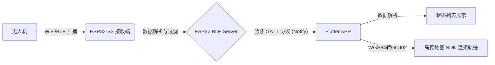

# 无人机 Remote ID 独立 APP (蓝牙通信) 架构与落地设计方案

选择“ESP32 蓝牙广播 + 独立 APP 地图渲染”是最符合商业产品逻辑的路径。为了保证项目能规范落地且少走弯路，以下是基于 **Flutter + 高德地图** 的详细架构设计、避坑指南和实施路径。

## 1. 整体系统架构

系统分为两端：**ESP32-S3 硬件端** 和 **手机 APP 客户端**。

## 2. 核心技术栈选型 (已确定)

*   **APP 跨平台框架**：**Flutter**。Google 出品的 UI 框架，性能接近原生，渲染极其丝滑，且拥有一套代码同时编译 Android 和 iOS 的能力，非常适合物联网硬件交互类 APP。
*   **地图引擎**：**高德地图 (AMap)**。国内加载速度最快，坐标系标准明确，且针对 Flutter 有官方或社区维护的完善插件（如 `amap_flutter_map`）。免费额度对该项目完全足够。
*   **蓝牙核心库**：`flutter_blue_plus`。目前 Flutter 生态中最稳定、维护最活跃的低功耗蓝牙 (BLE) 库。
*   **本地数据与状态管理**：推荐使用 `GetX` 或 `Provider` 进行状态管理，使用 `sqflite` 存储历史飞行轨迹和无人机档案。

## 3. 蓝牙通信规范设计 (GATT 协议)

这是最容易做得“不规范”的地方。不能只通过串口那种一锅粥的字符串发送，必须使用标准的 **BLE GATT (通用属性配置文件)** 规范。

*   **服务 (Service)**: 定义一个专属的 Remote ID 服务 (例如 UUID: `0000FF00-0000-1000-8000-00805F9B34FB`)。
*   **特征值 (Characteristic)**: 
    *   **特征 1 (基础信息 - Read/Notify)**：传输无人机 MAC、类型、自述 ID 等变化不频繁的数据。
    *   **特征 2 (实时位置 - Notify)**：传输高频更新的经度、纬度、高度、速度。
    *   **特征 3 (硬件状态 - Read)**：传输 ESP32 的电量、接收帧率、温度等。

> [!TIP]
> **数据封包建议**：不要传 JSON 字符串（占用带宽太大）。建议在 ESP32 端把数据打包成 **C 结构体 (Byte Array)**，Flutter 端接收到 `List<int>` 后，使用 `ByteData` 按照相同的字节顺序 (Endianness) 还原为浮点数和整数。这样一帧数据只有十几字节，极其高效。

## 4. 关键“避坑”指南（非常重要）

在实际落地中，这三个问题最容易导致项目失败或体验极差：

> [!WARNING]
> **1. 坐标系偏移问题 (天坑)**
> 无人机广播出来的经纬度是国际标准的 **WGS84** 坐标系。而高德地图底层使用的是 **GCJ-02 (火星坐标系)**。
> **后果**：如果不做转换，无人机在地图上的位置会偏移几百米（跑到河里或楼里）。
> **对策**：Flutter 收到 WGS84 坐标后，在将其赋值给高德地图的 `LatLng` 对象前，必须调用坐标转换算法（网上有现成的 Dart 版本 WGS84 转 GCJ02 算法）。

> [!CAUTION]
> **2. 蓝牙 MTU (最大传输单元) 限制**
> 蓝牙 BLE 默认每次只能发 **20 个字节** 的有效载荷。如果你把经纬度、高度、速度全塞进去绝对会截断。
> **对策**：在 `flutter_blue_plus` 连接上 ESP32 后，第一件事就是调用 `device.requestMtu(256)` **请求更改 MTU 大小**。

> [!IMPORTANT]
> **3. 手机后台保活与息屏断连**
> 手机一旦息屏，系统为了省电会杀掉 Flutter 进程或断开蓝牙。
> **对策**：如果需要长时间后台记录轨迹，Flutter APP 必须配置后台定位权限，并使用 `flutter_background_service` 等插件开启前台服务 (Foreground Service)。

## 5. Flutter 开发落地实施路径 (分阶段走)

不要妄想一步到位，建议分四个 Sprint（冲刺阶段）来落地：

### 阶段一：打通硬件与 Flutter 蓝牙 (1-2 周)
1. **ESP32 端**：写一个“假数据生成器”，ESP32 启动 BLE Server，每秒发送模拟的经纬度数据。
2. **Flutter 端**：新建 Flutter 工程，引入 `flutter_blue_plus`，实现扫描蓝牙设备、连接、订阅特征值。把收到的字节流解析成数字显示在 Text 组件上。
*目标：验证双端蓝牙通信稳定，不丢包，且 Flutter 能正确解析 C 语言发来的结构体字节。*

### 阶段二：高德地图集成与单机显示 (1-2 周)
1. **Flutter 端**：去高德开放平台申请 Android/iOS 的 API Key，在项目中引入高德地图 Flutter 插件。
2. **Flutter 端**：将接收到的模拟经纬度通过 Dart 算法进行 `WGS-84 -> GCJ-02` 转换。
3. **Flutter 端**：在地图上添加一个 Marker（无人机图标），监听蓝牙数据流 (Stream)，驱动 Marker 在地图上实时移动。
*目标：看到飞机在高德地图上动起来，坐标准确，且地图手势流畅。*

### 阶段三：真实数据接入与多机共存 (2 周)
1. **ESP32 端**：关闭假数据，把我们之前写的 WiFi 抓包解析出来的真实 `Basic ID` 和 `Location` 数据打包，通过蓝牙发出。数据包里带上无人机的 MAC 地址。
2. **Flutter 端**：实现状态管理（推荐 GetX）。收到数据时判断 MAC，新 MAC 则在地图上新建 Marker，老 MAC 则更新坐标，并在屏幕下方弹出一个浮动的 ListView 展示当前空域的无人机列表。
*目标：实现核心商业价值，能在手机上看到真实的、多架无人机动态。*

### 阶段四：产品化打磨 (轨迹与高级功能)
1. **轨迹绘制**：Flutter 端记录每个 MAC 的历史 GCJ-02 坐标点，使用高德地图的 `Polyline` 覆盖物在地图上画出飞行轨迹线。
2. **UI 体验设计**：采用明亮、清爽的浅色主题 (Light Mode) 结合现代化的 Material Design 3 设计规范。使用适当的阴影 (Shadow) 和圆角卡片来展示无人机数据面板，确保在户外强光下也能清晰可见。
3. **断线重连**：处理蓝牙意外断开的异常捕获，实现自动重连机制。

## 6. 开源项目参考与借鉴 (站在巨人的肩膀上)

为了避免重复造轮子，本方案在落地时将重点参考以下优秀的开源项目：

### Flutter APP 端参考
*   **[dronetag/flutter-opendroneid](https://github.com/dronetag/flutter-opendroneid)**: 
    *   **价值**：这是知名 Remote ID 公司 Dronetag 开源的 Flutter 插件。
    *   **借鉴点**：直接借鉴其将 ASTM F3411 规范的**字节流解码为 Dart 对象**的核心逻辑，免去枯燥的协议研读时间。

### ESP32 硬件端参考
*   **[opendroneid/opendroneid-core-c](https://github.com/opendroneid/opendroneid-core-c)**: 
    *   **价值**：OpenDroneID 官方 C 语言核心库。
    *   **借鉴点**：ESP32 解析底层 WiFi/BLE 广播数据包的标准做法。
*   **[colonelpanichacks/Sky-Spy](https://github.com/colonelpanichacks/Sky-Spy)** & **[andylee77/DroneMonitor](https://github.com/andylee77/DroneMonitor)**: 
    *   **价值**：两个专门基于 ESP32-S3 开发的无人机探测项目。
    *   **借鉴点**：参考其 WiFi 混杂模式的配置优化，以及在 C++ 中如何高效管理多个无人机 MAC 地址状态以防止内存溢出。

## 7. 后期产品化展望：WEB 页面的去留 (性能与功耗优化)

当独立 APP 链路完全打通并趋于稳定后，原有的基于 WiFi AP 的 WEB 页面将成为系统性能和续航的负担。针对 WEB 端的演进，我们建议采用 **“隐藏式后台管理面板”** 的方案：

### 为什么不建议彻底删除？
虽然彻底删除前端文件和 HTTP 服务端可以极致地节省内存和电量，但这会丧失极其便利的 **网页 OTA 固件升级** 功能。如果没有 WEB 页面，后续硬件固件升级将依赖复杂的蓝牙 OTA 或传统的 USB 数据线，增加维护成本。

### 推荐方案：“隐藏式管理模式”
1. **默认纯净模式**：设备日常开机时，**关闭** WiFi 热点和 WEB 服务器，仅开启 WiFi 被动监听 (抓包) 和低功耗蓝牙 (BLE广播)。此时系统将处于极低功耗状态，资源占用率趋近于零。
2. **长按激活维护模式**：在 ESP32 硬件上设定一个物理按键组合（如长按 BOOT 键 3 秒）。仅在需要更新维护时，触发该按键，设备才会点亮 WiFi 热点并启动 WEB 服务器。
3. **极简运维 UI**：剥离原有的复杂数据渲染（如图表、地图），WEB 页面仅提供两个核心功能：**硬件状态诊断** 与 **OTA 固件上传**。

这种设计是当前智能硬件（如智能音箱、路由器）的行业标配，既能保证日常使用的续航与稳定，又兼顾了售后维护的便捷性。
